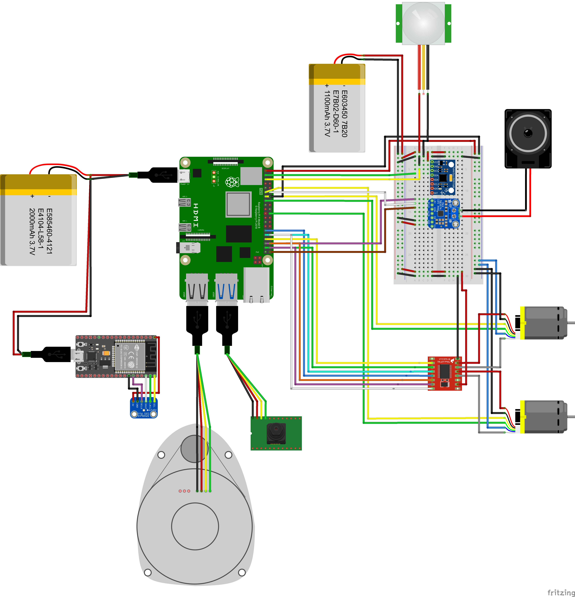

# Segurito 


## Tabla de Contenidos

1. [Introducción](#introducción)
2. [Componentes y Costos](#componentes-y-costos)
3. [Características](#características)
4. [Modelo 3D](#modelo-3d)
5. [Diagramas de Arquitectura](#diagramas-de-arquitectura)
   - [Diagrama de Hardware](#diagrama-de-hardware)
   - [Diagrama de Software](#diagrama-de-software)
6. [Instalación](#instalación)
   - [Requisitos](#requisitos)
   - [Guía de Instalación](#guía-de-instalación)
7. [Uso](#uso)
   - [Escaneo y Mapeo LiDAR](#escaneo-y-mapeo-lidar)
   - [Detección de Movimiento](#detección-de-movimiento)
   - [Reconocimiento de Objetos y Rostros](#reconocimiento-de-objetos-y-rostros)
   - [Monitoreo Remoto](#monitoreo-remoto)
8. [Algoritmos](#algoritmos)
9. [Simulación](#simulación)
10. [Contribuidores](#contribuidores)
11. [Licencia](#licencia)

---

## Introducción

Segurito es un robot de seguridad autónomo diseñado para patrullar y supervisar espacios como lo haría un vigilante dedicado. Equipado con sensores avanzados y conectividad en la nube, Segurito:

- Mapea su entorno usando algoritmos LiDAR y SLAM
- Detecta obstáculos y objetos en movimiento para una navegación segura
- Identifica humanos y animales mediante reconocimiento por cámara
- Autentica al personal autorizado usando reconocimiento facial
- Activa alarmas y envía notificaciones remotas al detectar intrusos
- Atiende comandos de voz a través de un micrófono integrado

Segurito combina hardware con módulos de software inteligentes para dar una solución de seguridad integral.

---

## Características

- **Mapeo Autónomo**: Genera un mapa en tiempo real del entorno usando LiDAR y SLAM.
- **Evitación de Colisiones**: Detecta y evita obstáculos.
- **Detección de Movimiento**: Sensor PIR para mayor precisión.
- **Reconocimiento de Humanos y Animales**: Clasifica las figuras capturadas por la cámara.
- **Autenticación Facial**: Reconoce rostros autorizados para dar accesos.
- **Sistema de Alarma**: Emite sonidos a traves del altavoz al detectar intrusos.
- **Comandos de Voz**: Micrófono para recibir instrucciones.
- **Conectividad en la Nube**: Envía alertas y transmisión de video en vivo a un panel remoto.


---

## Componentes y Costos

| Componente                  | Cantidad | Costo Aprox. (USD) | Enlace al Proveedor     |
|-----------------------------|:--------:|-------------------:|-------------------------|
| Micro Metal Motors          |    2     |             35.00  | [Enlace](https://tienda.bricogeek.com/motores/113-motor-micro-metal-lp-con-reductora-10-1.html)                   |
| Raspberry Pi 4B (4 GB RAM)  |    1     |             67.90  | [Enlace](https://tienda.bricogeek.com/placas-raspberry-pi/1330-raspberry-pi-4-model-b-4-gb.html)                  |
| Sensor de Movimiento PIR    |    1     |             1.85   | [Enlace](https://tienda.bricogeek.com/sensores-distancia/1270-modulo-sensor-pir-hc-sr501.html)                    |
| RPLIDAR-C1                  |    1     |             79.95  | [Enlace](https://tienda.bricogeek.com/sensores-distancia/1943-rplidar-c1-360-grados-12-metros-ip54.html)          |
| Acelerometro y Giroscopio   |    1     |             2.95   | [Enlace](https://tienda.bricogeek.com/acelerometros/1682-modulo-gy-521-acelerometro-y-giroscopio-mpu-6050.html)   |
| Ruedas Solarbotic           |    2     |             9.80   | [Enlace](https://tienda.bricogeek.com/ruedas-robotica/1008-rueda-solarbotics-rw2i.html)                           |
| Rueda Loca                  |    1     |             5.50   | [Enlace](https://tienda.bricogeek.com/robotica/995-rueda-loca-plastico-abs-34.html)                               |
| Altavoz                     |    1     |             5.50   | [Enlace](https://tienda.bricogeek.com/varios/938-altavoz-con-caja-3w.html)                                        |
| Controladores de Motor      |    1     |             5.95   | [Enlace](https://tienda.bricogeek.com/controladores-motores/999-controlador-de-motores-tb6612fng.html)            |
| Microfono                   |    1     |             7.30   | [Enlace](https://tienda.bricogeek.com/sensores-sonido/1475-microfono-digital-mems-i2s-sph0645.html)               |
| Controladora de Microfono   |    1     |             6.50   | [Enlace](https://tienda.bricogeek.com/arduino-compatibles/1274-nodemcu-esp32-wroom-wifi-bluetooth.html)           |
| Camara                      |    1     |             19.95  | [Enlace](https://tienda.bricogeek.com/accesorios-raspberry-pi/822-camara-raspberry-pi-v2-8-megapixels.html)       |
| Encoders de Motor           |    2     |             8.50   | [Enlace](https://tienda.bricogeek.com/accesorios-motores/932-encoders-para-motores-micro-metal-12cpr.html)        |
| Powerbank y Bateria         |    2     |             10.00  | —                                                                                                                 |
| Breadboard y Cables         |    1     |             0.00   | —                                                                                                                 |
| Chasis Impreso en 3D        |    1     |             4.00   | —                                                                                                                 |
| **Total**                   |          |          **270.60**|                                                                                                                   |

---

## Modelo 3D

El chasis completo del robot y los soportes de los componentes han sido diseñados en Fusion 360. Puedes encontrar los archivos del modelo aquí:

- `3Dmodels/Base.stl`
- `3Dmodels/SegundaPlanta.stl`
- `3Dmodels/Cupula.stl`

Vista Previa del Ensamblaje 3D


---

## Diagramas de Arquitectura

### Diagrama de Hardware



### Diagrama de Software


---

## Instalación

### Requisitos

**Software**

- Python 3.9+
- OpenCV 4.x
- ROS Noetic
- NumPy, SciPy, Scikit‑learn
- Librería SLAM (p. ej., `rtabmap_ros`)
- TensorFlow o PyTorch (para modelos de reconocimiento)

### Guía de Instalación

1. **Flashear el Sistema Operativo**
   ```bash
   sudo dd if=raspbian.img of=/dev/sdX bs=4M status=progress
   ```
2. **Actualizar el Sistema**
   ```bash
   sudo apt-get update && sudo apt-get upgrade -y
   ```
3. **Instalar ROS Noetic**
   ```bash
   sudo apt install ros-noetic-desktop-full
   source /opt/ros/noetic/setup.bash
   ```
4. **Instalar el Driver del LiDAR**
   ```bash
   sudo apt install ros-noetic-ydlidar
   ```
5. **Clonar el Repositorio**
   ```bash
   git clone https://github.com/yourusername/segurito.git
   cd segurito
   ```
6. **Instalar Dependencias de Python**
   ```bash
   pip install -r requirements.txt
   ```
7. **Compilar y Ejecutar**
   ```bash
   catkin_make
   source devel/setup.bash
   roslaunch segurito main.launch
   ```
   
---

## Uso

### Escaneo y Mapeo LiDAR
   ```bash
   rosrun segurito lidar_mapping.py \
   --scan_topic /scan \
   --output_map maps/segurito_map.pgm
   ```

Genera una barrida de 360°, recoge nubes de puntos y guarda un mapa de ocupación.

### Detección de Movimiento
   ```bash
   python3 src/motion_detector.py
   ```

Monitorea el sensor PIR conectado al GPIO 17.

### Reconocimiento de Objetos y Rostros
   ```bash
   rosrun segurito recognition_node.py \
   --model models/face_recognition.pkl
   ```

Monitorea el sensor PIR conectado al GPIO 17.

### Monitoreo Remoto

Accede a video en vivo y alertas en: [Enlace](https://...)

---

## Algoritmos

- **SLAM**: Fusión con RTAB‑Map de nubes de puntos LiDAR y odometría.
- **Planificación de Rutas**: A* sobre la cuadrícula de ocupación.
- **Clasificación de Objetos**: CNN ResNet‑50 entrenada con COCO.
- **Reconocimiento Facial**: Embeddings FaceNet + SVM.
- **Alerta de Intrusos**: Combina confianza del reconocimiento con entrada PIR.

---

## Simulación

Ejecuta la escena en CoppeliaSim antes del despliegue de hardware:
   ```bash
   coppeliaSim.sh scenes/segurito_scene.ttt
   ```

---

## Contribuidores

- 1 (@yourusername) — Líder de Proyecto, SLAM y Navegación  
- 2 (@colleagueA) — Visión y Reconocimiento  
- 3 (@colleagueB) — Integración de Hardware  

¡Contribuciones bienvenidas! Consulta `CONTRIBUTING.md`.  

---

## Licencia
